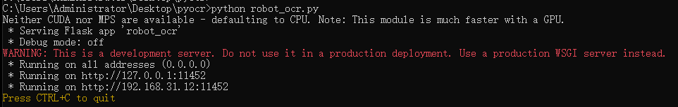
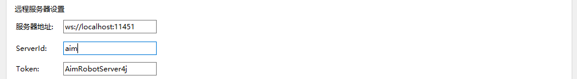
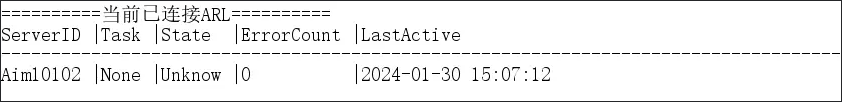
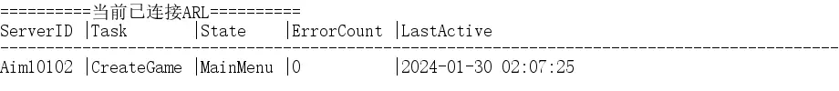

# ARL配置-自动任务
# 准备工作
1. ARL的自动任务配置和使用起来较为麻烦以及难以理解，在此默认阅读此文章的你需要有很强的动手能力
2. 你需要一台服务器，并且建议4C 4G配置以上 

# 开始

## 一、部署OCR服务
ARL的自动任务，有一部分是依赖于OCR（图像识别）的实现，因此需要配置一套Python环境，并按照 [使用说明](https://github.com/H4rry217/bfvrobot-ocr) 进行配置和部署  
如果有显卡，在部署时可下载GPU版本的Pytorch用于加快识别速度

最终OCR服务部署好后，需要提供一个可让ARL所在机器，能进行请求的Http服务地址

## 二、部署ARSJ（AimRobot-server4j）
参考 [ARSJ开源项目](https://github.com/H4rry217/AimRobot-server4j)  
ARSJ是一个后台终端，允许多个ARL程序同时连接并管理，并以Http接口的形式提供基础的功能

## 三、配置ARL程序
  
ARL会通过Websocket与ARSJ进行通信，其中
- **服务器地址**: 你在 *步骤二* 中，所部署的ARSJ的地址
- **ServerId**: 表示每个ARL程序的 ***识别码***，因为一个ARSL允许多个ARL同时连接（可以理解为群组），ARSJ需要分别不同的ARL程序，所以需要识别码
- **Token**: 类似于双方约定的密码，用于ARSJ判断连接的ARL是否合法，可以从所连接的ARSJ服务中获取对应的Token，再填写至此处

填写对应的信息后，**将ARL与ARSJ远程服务器进行连接**

切换至ARL的 `自动任务` 页，并勾选 **启用自动任务**  
将 `OCR服务` 设置为你在 *步骤一* 中所部署的OCR服务的地址

## 四、配置Kook机器人（可选）
[KookBot](https://github.com/H4rry217/AimRobot-kookbot) 以对ARSJ相关的自动任务接口进行了包装  
使得对Kook机器人发送指令文字即可执行对应的任务，但你仍可以对ARSJ进行Http请求来达到相同的目的

# 概念
## 自动任务

自动任务是指将多个操作（点击按钮、点击键盘）等与图像识别一起包装成一个任务(Task)  
ARL支持多个任务(Task)，**且同一时刻仅能执行一个任务**
- **OpenGame**: 打开游戏
	- 当BFV游戏并没有启动的时候，可以使用该任务启动游戏
- **CreateGame**: 以你设置中的第一个游戏设置，创建一个房间
	- 未创建房间时，**当游戏处于主菜单界面**，可使用该任务创建游戏房间
- **QuitGame**: 退出当前的房间
	- 当在处于游戏内/观战时，使用该任务后会退回至游戏主菜单界面
- **ObserveGame**: 观战自己的房间
	- 当已经创建了房间，并且处在游戏主菜单界面时，使用该任务后会自动进入观战位
- **CloseGame**: 关闭自己已经创建了的游戏对局
	- 当已经创建了房间，并且处在游戏主菜单界面时，使用该任务后会关服
- **CancelTask**: 取消当前执行的任务
	- 当前ARL执行其它任务(Task)时，使用该任务会取消先前执行的任务

## 任务组合
比如：
- 当你想开服时，你可以先使用 `OpenGame` 打开游戏，然后再使用 `CreateGame` 创建房间
- 当服务器暖好后，使用 `QuitGame` 退出至游戏主界面，然后再使用 `ObserverGame` 进入游戏观战位

ARL的任务功能并不是全自动的，由于OCR的原因，*任务的执行情况其实是个**黑盒***，ARL自己也不清楚是否执行成功，
所以ARSJ提供了对游戏进行截图、以及获取OCR识别情况的接口

在KookBot中，**提供了 `jt` 和 `server` 指令用于使用者对任务执行状态查询的目的**

- **Task**: 当前服务器正在执行的任务， `None` 表示目前为空置状态（未执行任何任务）
- **State**: 当前OCR所识别到的游戏处在什么界面，仅会在执行Task时进行识别
- **ErrorCount**: 当前任务执行时，识别错误或重复识别的次数
	- 当此项为 `10` 时，则表示错误次数超过了重试次数，所以当前任务会停止
	- **此项不能用于判断任务是否执行失败**，仅用于辅助判断任务是否停止执行

### 某些时候存在一些情况：  
如：当机器人处在房间内时，执行 `QuitGame` 任务完毕后，可能并不会处于游戏主菜单界面  
这是因为OCR存在识别率的原因，所以可能会在退出到一半时，任务就结束了  
（比如正常应该是退出到游戏主菜单界面，实际上仅仅退出到了服务器列表的界面）

当这种情况存在时，可以先使用 `jt` 指令根据返回的游戏截图判断当前所处的游戏界面  
然后根据情况继续使用 `QuitGame` 直至游戏处于主菜单界面；或者人工干预，手动连接远端电脑主机进行操作

